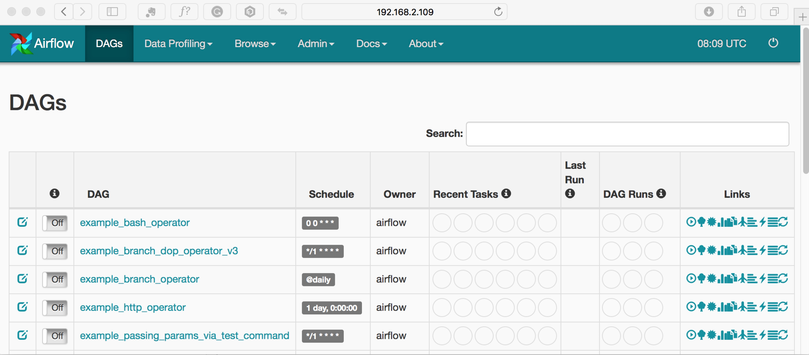

<!-- TOC -->

- [run with docker-compose](#run-with-docker-compose)
- [run with docker stack](#run-with-docker-stack)
- [ui](#ui)

<!-- /TOC -->

# run with docker-compose

> docker compose v2

```
$ docker-compose up -d
Creating airflow-docker-compose-example_db_1            ... done
Creating airflow-docker-compose-example_airflow_redis_1 ... done
Creating airflow-docker-compose-example_airflow_scheduler_1 ... done
Creating airflow-docker-compose-example_airflow_webserver_1 ... done
Creating airflow-docker-compose-example_airflow_worker_1    ... done
Creating airflow-docker-compose-example_airflow_flower_1    ... done


$ hyper ps
CONTAINER ID        IMAGE               COMMAND                  CREATED              STATUS              PORTS                                        NAMES                SIZE                IP
5ab02a419db1        airflow:latest      "./wait-for-it.sh ai…"   3 seconds ago        Up 1 second         5555/tcp, 8793/tcp, 0.0.0.0:8080->8080/tcp   airflow-docker-compose-example_airflow_webserver_1
91859cca3601        airflow:latest      "./wait-for-it.sh ai…"   3 seconds ago        Up 1 second         8080/tcp, 0.0.0.0:5555->5555/tcp, 8793/tcp   airflow-docker-compose-example_airflow_flower_1
407a7cc95f4e        airflow:latest      "./wait-for-it.sh ai…"   3 seconds ago        Up 2 seconds        5555/tcp, 8080/tcp, 8793/tcp                 airflow-docker-compose-example_airflow_worker_1
0a97093d4666        airflow:latest      "./wait-for-it.sh db…"   4 seconds ago        Up 3 seconds        5555/tcp, 8080/tcp, 8793/tcp                 airflow-docker-compose-example_airflow_scheduler_1
ac0d4cde9429        mysql:5.7           "docker-entrypoint.s…"   5 seconds ago        Up 3 seconds        0.0.0.0:3306->3306/tcp, 33060/tcp            airflow-docker-compose-example_db_1
ff3c191d16be        redis:3.2           "docker-entrypoint.s…"   5 seconds ago        Up 4 seconds        6379/tcp                                     airflow-docker-compose-example_airflow_redis_1


$ docker-compose down
Stopping airflow-docker-compose-example_airflow_webserver_1 ... done
Stopping airflow-docker-compose-example_airflow_flower_1    ... done
Stopping airflow-docker-compose-example_airflow_worker_1    ... done
Stopping airflow-docker-compose-example_airflow_scheduler_1 ... done
Stopping airflow-docker-compose-example_db_1                ... done
Stopping airflow-docker-compose-example_airflow_redis_1     ... done
Removing airflow-docker-compose-example_airflow_webserver_1 ... done
Removing airflow-docker-compose-example_airflow_flower_1    ... done
Removing airflow-docker-compose-example_airflow_worker_1    ... done
Removing airflow-docker-compose-example_airflow_scheduler_1 ... done
Removing airflow-docker-compose-example_db_1                ... done
Removing airflow-docker-compose-example_airflow_redis_1     ... done
Removing network airflow-docker-compose-example_default
```

# run with docker stack

> docker compose v3

```
$ docker stack deploy -c docker-compose-v3.yml airflow
unsupported Compose file version: 2

$ docker swarm join-token manager
To add a manager to this swarm, run the following command:

    docker swarm join --token SWMTKN-1-1qifynabd8dcpylldeego2ijj8z9y0uvcw5fxft4imkg34z3o9-2exyigyksexx8ohwyjhb2lyfe 192.168.65.3:2377

$ docker info | grep -i swarm
Swarm: active

$ hyper stack deploy -c docker-compose-v3.yml airflow
Creating network airflow_default
Creating service airflow_airflow_webserver
Creating service airflow_airflow_flower
Creating service airflow_airflow_scheduler
Creating service airflow_airflow_worker
Creating service airflow_airflow_redis
Creating service airflow_db

$ hyper stack ls
NAME                SERVICES            ORCHESTRATOR
airflow             6                   Swarm

$ docker stack ps airflow
ID                  NAME                          IMAGE               NODE                    DESIRED STATE       CURRENT STATE           ERROR                       PORTS
mficrql2mvbn        airflow_airflow_scheduler.1   airflow:latest      ec2-xxxx                Running             Running 4 minutes ago
tz1kb30poxvs        airflow_db.1                  mysql:5.7           ec2-xxxx                Running             Running 4 minutes ago
k9nt0stq6kxn        airflow_airflow_webserver.1   airflow:latest      ec2-xxxx                Running             Running 4 minutes ago
p1njfiat4vzp        airflow_airflow_redis.1       redis:3.2           ec2-xxxx                Running             Running 5 minutes ago
omkbm8w3z2r4        airflow_airflow_worker.1      airflow:latest      ec2-xxxx                Running             Running 5 minutes ago
js78v45ke2do        airflow_airflow_flower.1      airflow:latest      ec2-xxxx                Running             Running 5 minutes ago

$ docker ps
CONTAINER ID        IMAGE               COMMAND                  CREATED             STATUS              PORTS                          NAMES               SIZE                IP
72662e6d5e11        airflow:latest      "./wait-for-it.sh db…"   5 minutes ago       Up 5 minutes        5555/tcp, 8080/tcp, 8793/tcp   airflow_airflow_scheduler.1.mficrql2mvbneglahqpfetaeu
70a3894ddfe7        airflow:latest      "./wait-for-it.sh ai…"   5 minutes ago       Up 5 minutes        5555/tcp, 8080/tcp, 8793/tcp   airflow_airflow_webserver.1.k9nt0stq6kxngkhr6hy9lde2b
acc3065c8869        mysql:5.7           "docker-entrypoint.s…"   5 minutes ago       Up 5 minutes        3306/tcp, 33060/tcp            airflow_db.1.tz1kb30poxvsgpqbivhsxpv5e
96e4cfe82fe6        redis:3.2           "docker-entrypoint.s…"   5 minutes ago       Up 5 minutes        6379/tcp                       airflow_airflow_redis.1.p1njfiat4vzpj0sq9fd29hcb3
fa2a6a0cce3a        airflow:latest      "./wait-for-it.sh ai…"   5 minutes ago       Up 5 minutes        5555/tcp, 8080/tcp, 8793/tcp   airflow_airflow_worker.1.omkbm8w3z2r4iq4so21olzo15
ef0eb5a626b6        airflow:latest      "./wait-for-it.sh ai…"   5 minutes ago       Up 5 minutes        5555/tcp, 8080/tcp, 8793/tcp   airflow_airflow_flower.1.js78v45ke2dokjhf2qqbbdnat
```

# ui


